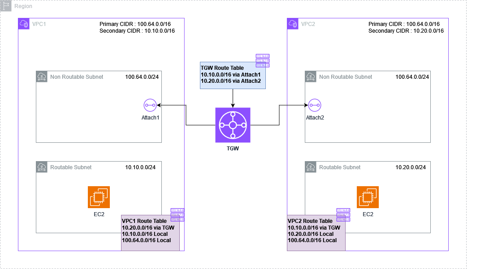

# Transit Gateway with Overlapping CIDRs Demonstration

## ⚠️ Important Disclaimer

**This project is for testing and demonstration purposes only.**

Please be aware of the following:

- The infrastructure deployed by this project is not intended for production use.
- Security measures may not be comprehensive or up to date.
- Performance and reliability have not been thoroughly tested at scale.
- The project may not comply with all best practices or organizational standards.

Before using any part of this project in a production environment:

1. Thoroughly review and understand all code and configurations.
2. Conduct a comprehensive security audit.
3. Test extensively in a safe, isolated environment.
4. Adapt and modify the code to meet your specific requirements and security standards.
5. Ensure compliance with your organization's policies and any relevant regulations.

The maintainers of this project are not responsible for any issues that may arise from the use of this code in production environments.

---

## Project Overview

This project demonstrates that it's possible to use the same CIDR range for Transit Gateway (TGW) attachments in different VPCs without causing issues. The setup showcases a network architecture using AWS Transit Gateway to connect multiple VPCs with overlapping IP address spaces.

## Key Components

- 2 VPCs (VPC1 and VPC2) with primary and secondary CIDR blocks
- 1 AWS Transit Gateway
- 4 Subnets (2 per VPC: 1 routable, 1 non-routable)
- Transit Gateway attachments using the non-routable subnets
- Custom route tables for VPCs and Transit Gateway

## Network Configuration

- VPC1 CIDR: 10.10.0.0/16
- VPC2 CIDR: 10.20.0.0/16
- Secondary CIDR for both VPCs: 100.64.0.0/16
- TGW attachments use subnets from the secondary CIDR range (100.64.0.0/16)

## Key Demonstration Points

1. **Overlapping CIDRs for TGW Attachments**: Both VPCs use the same secondary CIDR block (100.64.0.0/16) for their TGW attachment subnets.
2. **Routing Separation**: Despite the overlapping CIDRs, proper routing is maintained through custom route tables.
3. **VPC Isolation**: The primary CIDR blocks of the VPCs remain unique, ensuring overall network isolation.

## Project Structure

The project uses Terraform to define and deploy the infrastructure. Key resources include:

- VPCs and their CIDR blocks
- Subnets (routable and non-routable)
- Transit Gateway and its route table
- TGW attachments
- VPC route tables and associations

## Deployment

To deploy this demonstration:

1. Ensure you have Terraform installed and AWS credentials configured.
2. Clone this repository.
3. Navigate to the project directory.
4. Run `terraform init` to initialize the Terraform working directory.
5. Run `terraform plan` to see the execution plan.
6. Run `terraform apply` to create the resources.

## Conclusion

This project successfully demonstrates that using the same CIDR range (specifically, the secondary CIDR block) for Transit Gateway attachments across different VPCs does not cause conflicts or issues. It showcases a practical approach to managing complex network architectures with overlapping IP spaces in AWS.

## License

This project is licensed under the terms of the [LICENSE](LICENSE) file included in this repository.
